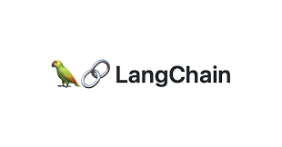

# LLMs and LangChain Practice

    

> LangChain은 LLMs를 이용한 애플리케이션 개발을 보다 쉽고 편리하게 작업할 수 있도록 대부분의 기능을 제공해주는 프레임워크이다.

## Components

### Schema

- Text : LLMs와 소통하는 가장 기본 방식

- ChatMessages : System, Human, AI 등으로 메세지 타입을 나누는 방식

- Document : 텍스트와 메타데이터를 하나의 객체로 표현하는 방식

### Models

- Language Model

- Chat Model

- Text Embedding Model

### Prompts

- Prompt Template

- Example Selectors : 프롬프트들을 동적으로 배치하는 기능

- Output Parsers : 구조화된 출력을 해주는 기능

### Indexes

- Document Loaders : 다양한 파일, url 및 문서들을 불러올 수 있는 기능

- Text Splitters : 긴 문서를 제어할 수 있는 기능

- Retrievers : LLMs와 문서들을 연결하는 기능

- Vector Store : 벡터들을 저장하는 저장소

### Memory - 정보를 기억할 수 있도록 돕는 기능

- Chat Message History

### Chains - 다양한 LLM을 호출하고 여러가지 작업을 결합하는 기능

- SimpleSequentialChain

- load_summarize_chain

### Agents - 다양한 도구(Tools)들을 지원하며, 원하는 작업을 수행할 수 있는 기능

- Agents

- Tools 